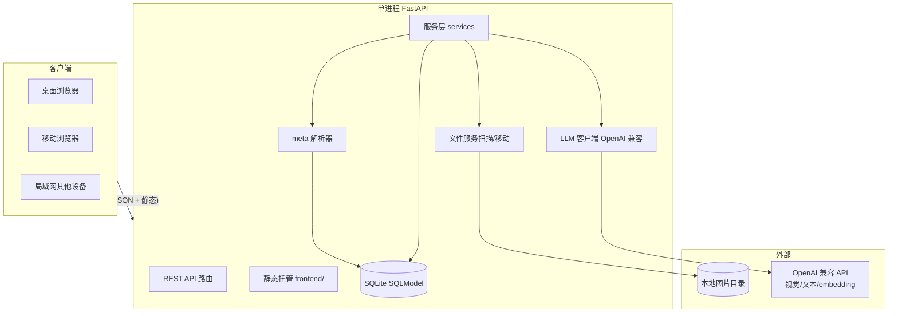

# ArtMirror（画镜）— ComfyUI 图片/提示词资产管理工具 实施计划（修订版）

本次修订依据用户反馈：① 不用 Java，采用更轻量、跨客户端兼容性强的架构；② 先交付可视化原型（图库页/聚合页/详情预览页/设置页）；③ 补齐 meta 解析、聚合聚类、评分反推展示、扫描与文件移动的实现细节。

## 一、需求总览

独立 Web 应用，统一管理 ComfyUI 产出图片及内嵌工作流，提供 AI 增强。11 项需求：

| # | 需求 | 归类 |
|---|------|------|
| 1 | 配置本地路径、扫描图片、多级目录/平铺展示 | 导入浏览 |
| 2 | 解析 meta 并可视化：提示词展示、复制/导出/预览工作流 | 元数据 |
| 3 | 预览、提示词在图片下方、模型/LoRA/VAE 标签筛选 | 浏览标签 |
| 4 | 整理：新建/修改目录、调整存储位置 | 文件管理 |
| 5 | 大模型图片反推提示词，标注“反推” | AI |
| 6 | 大模型中英翻译 | AI |
| 7 | 相同提示词多图聚合卡片、点击展开 | 聚合 |
| 8 | AI/人工评分，高评分优先 | 评分 |
| 9 | 提示词搜索/筛选、命中高亮 | 检索 |
| 10 | 相似提示词归类聚合 | 聚类 |
| 11 | 提示词按维度分组展示 | 维度分组 |

## 二、技术选型（修订）

### 2.1 环境（实测）
- Python 3.13.14 + uv 0.12.4；Node 24 + pnpm 11；Java 17 + Maven（**不使用**）。

### 2.2 ComfyUI 元数据格式（Web 调研）
- 每张 PNG 写入文本 chunk：`workflow`(UI 图 JSON)、`prompt`(API 图 JSON)。chunk 内容为 base64→latin1 转码存储，需 `base64.b64decode(data.encode('latin1'))` 后 `json.loads`（需容错纯 JSON）。
- 从 `prompt` 图按 `class_type` 提取：`CLIPTextEncode`(text→提示词/负提示词)、`CheckpointLoaderSimple`(ckpt→模型)、`LoraLoader`(lora)、`VAELoader`(vae)、`KSampler`(seed/steps/cfg/sampler/scheduler/denoise)。
- 已有工具均为 ComfyUI 自定义节点，非独立 Web 资产管理系统；本工具定位独立，成立。

### 2.3 选型决定（不用 Java，轻量 + 高兼容）
- **后端：Python 3.13 + FastAPI + uvicorn**。单进程同时提供 REST API 与静态前端托管；无需 Node 服务。async 适配 LLM 调用。
- **数据库：SQLite + SQLModel（SQLAlchemy 2.0）**。单机文件即库，零运维。
- **前端：无构建、轻量、跨客户端兼容**：
  - 静态 HTML + CSS + JS，由 FastAPI 托管（亦可直接双击打开原型页）。
  - **Alpine.js**（CDN，约 15KB）提供响应式/交互；普通 JS 完成其余逻辑。
  - **PicoCSS**（或极轻量手写 CSS）负责响应式与简洁样式，桌面/移动可用。
  - 不引入 Vue/React 构建链，保持“打开即用、几乎所有浏览器可运行”。
- **大模型：兼容 OpenAI 协议（配置化）**。支持视觉模型(反推/评分看图)、文本模型(翻译/AI 评分)、可选 Embedding(相似聚类)。
- **测试：pytest + pytest-asyncio + httpx**（后端）。

### 2.4 架构总览（mermaid）



## 三、数据模型（修订如无特殊注明同前）

- **folder**：id, parent_id(self FK 可空), name, path, sort_order, is_deleted, create_time, update_time
- **image_asset**：id, folder_id(FK), file_name, file_path, sha256, width, height, file_size, file_mtime, thumb_ok, scan_time, rating(人工 1-5 可空), ai_rating(0-100 可空), is_deleted, create_time, update_time。索引 file_path 唯一、folder_id、rating、ai_rating。
- **workflow_meta**：id, image_id(FK 1:1), prompt, negative_prompt, prompt_graph_json, workflow_json, steps, cfg, sampler, scheduler, seed, denoise, model_name, is_deleted, create_time, update_time
- **tag**：id, name, category(model/lora/vae/embedding/style/special), is_deleted；name+category 唯一
- **image_tag**：image_id, tag_id（多对多）
- **reverse_prompt**：id, image_id(FK), engine, model_name, text, create_time（与原生分离）
- **prompt_translation**：id, image_id, prompt_kind(origin/reverse), lang(zh/en), text, create_time
- **rating_record**：id, image_id, rating_type(ai/manual), score, reason, create_time（历史；`image_asset` 存最新值）
- **cluster_group**：id, group_key, cluster_type(exact/similar/dimension), name, sort_rank, is_deleted, create_time（聚类/维度结果，可后置）
- **setting**：id, key, value（扫描路径、LLM 配置、UI 偏好）

## 四、后端模块

```
backend/
  app/
    main.py config.py database.py
    models/ schemas/
    parsers/comfyui_parser.py
    services/
      scanner.py folder_service.py meta_service.py
      llm_client.py ai_service.py rating_service.py
      aggregate_service.py search_service.py
    routers/  # images folders meta tags ai aggregate search settings
    worker.py  # 后台任务：扫描/批量AI/缩略图
frontend/  # 静态无构建前端（FastAPI 托管）
  index.html gallery.html aggregate.html image.html settings.html
  app.js api.js style.css
```

### 4.1 meta 解析口径（实现细节）
1. Pillow 打开图像，取 `img.text`（或 `img.info`）中的 `workflow`、`prompt` chunk。
2. 解码：优先 `json.loads(raw)`；失败则 `base64.b64decode(raw.encode('latin1'))` 再 `json.loads`（再失败记 parse_error 不回滚入库，提示词留空）。
3. 提取提示词：遍历 `prompt` 节点 dict，按输出连接关系区分正/负——KSampler `inputs.positive[0]` 连到的 `CLIPTextEncode` 输出其 `inputs.text` 为正，`negative[0]` 连到的为负。找不到连接关系时回退：收集全部 CLIPTextEncode 文本，默认取第一条为正向、其余并按常见命名启发式归类（记录计为正向/候选）。**保证：原生提示词、负提示词分别落 `workflow_meta.prompt / negative_prompt`。**
4. 提取模型/LoRA/VAE：`CheckpointLoaderSimple.inputs.ckpt_name→tag(model)`、`LoraLoader.inputs.lora_name→tag(lora)`、`VAELoader.inputs.vae_name→tag(vae)`；并按文件名前缀启发式打 `style` 标签（可选）。
5. 提取参数：KSampler steps/cfg/sampler_name/scheduler/seed/denoise。
6. 生成缩略图：`image.thumbnail` → WebP 存 `data/thumbs/<sha256>.webp`；PG 后台生成，`thumb_ok` 标记。

### 4.2 扫描与文件整理（实现细节）
- **扫描（需求 1）**：递归遍历配置根目录；扩展名 png/jpg/jpeg/webp/bmp/gif。增量策略：比较 `(file_mtime, file_size)`，未变化跳过不重算 sha；新增/变化文件算 `sha256` 去重；数据库中在根内但文件已消失 → 软删置 `is_deleted=1`。扫描跑后台任务，进度写 setting/前台轮询。
- **目录管理（需求 4）**：新建/重命名/删除目录（删除需空或二次确认并级联软删）；在目录树拖拽移动图片。
- **移动（需求 4）**：同一步骤先落库（`folder_id`/`file_path`）开启事务，再 `shutil.move`（跨设备安全）；成功后提交，失败回滚。目标冲突自动加 `-1` 后缀并在结果中提示。全程校验目标在根目录内（`Path.resolve()` 前缀检查）防路径穿越。

### 4.3 LLM 与 AI 服务
- `llm_client.py`：httpx 封装 `chat/completions`；视觉（`image_url` base64）、文本、可选 `embeddings`。统一超时/错误回退。
- 反推（需求 5）：图片 base64 + 结构化提示词模板 → 视觉模型 → 结果落 `reverse_prompt`，`image_asset.prompt_type=reverse`，前端标“反推”角标。
- 翻译（需求 6）：文本模型，对原生/反推提示词互译，落 `prompt_translation`。
- AI 评分（需求 8）：图片+提示词 → 0-100 分 + reason → 落 `rating_record` 与 `image_asset.ai_rating`。

### 4.4 聚合/聚类/检索
- **相同聚合（需求 7）**：规范化键 `" ".join(prompt.lower().strip().split())`，SQL `GROUP BY` 即时分组。分组卡片展示成员数、封面=组内最高分图、缩略墙；点击展开成员。支持手动评分/反推后仍可归组。
- **相似聚类（需求 10）**：MVP 用 `difflib.SequenceMatcher` 相似度≥阈值(默认 0.92) 两两建边 + 并查集聚合；结果写入 `cluster_group(cluster_type=similar)`。可选增强：OpenAI 兼容 Embedding + 余弦相似 + 凝聚聚类（后置，需配置 embedding 模型）。
- **维度分组（需求 11）**：按 `tag.category`（model/lora/vae/style/...）分组，聚合页折叠面板展示各组图片数。
- **搜索（需求 9）**：关键词对 prompt/negative_prompt/tag 做过滤（SQLite LIKE 或多关键词 AND）；返回 `highlight_terms`，前端高亮命中词。

## 五、前端（无构建、轻量高兼容）

- 纯静态多页面：`index.html`(图库)、`gallery.html`、`aggregate.html`、`image.html`(详情/预览)、`settings.html`。直接用 `<script src>` 引入 Alpine + 本工具 app.js；FastAPI 托管同源，亦可本地双击预览原型（mock 数据）。
- 响应式：桌面网格多列，移动端单列卡片；触控友好。

### 5.1 页面布局（原型范围已确认）
- **图库页 gallery**：左目录树 + 顶部筛选栏(搜索框/标签筛选/平铺·目录切换) + 网格卡片。卡片=缩略图 + 下方提示词（可折叠）+ 模型/LoRA/VAE 标签chips。
- **聚合页 aggregate**：顶部切换 提示词分组/维度分组 + 评分排序；提示词分组卡片（成员数+封面+展开成员）；维度分组折叠面板。
- **详情/预览页 image**：大图（灯箱）+ 右侧信息：原生提示词/反推提示词（区分角标）、复制/翻译按钮、工作流预览&导出/复制、模型/参数 chips、人工评分星级、AI 评分+原因。
- **设置页 settings**：本地路径配置、LLM 配置（base_url/api_key/视觉模型/文本模型/embedding 模型）、扫描按钮与进度、批量 AI（反推/翻译/评分）入口。
- **工作流预览**：WorkflowView 以只读 JSON/节点图展示 `workflow_json`，提供“复制 JSON”“导出 .json”“提示可拖回 ComfyUI 画布”。

## 六、功能 ↔ 模块映射

| 需求 | 后端 | 前端 | 阶段 |
|------|------|------|------|
| 1 扫描/浏览 | scanner | gallery 目录树+网格 | M1 |
| 2 meta 可视化 | comfyui_parser\meta_service | gallery/image 提示词+工作流 | M1 |
| 3 预览+标签筛选 | meta_service\search | gallery 卡片+chips+筛选 | M1/M2 |
| 4 整理 | folder_service | gallery 目录操作/拖拽 | M2 |
| 5 反推 | ai_service | image/gallery AI 按钮+角标 | M3 |
| 6 翻译 | ai_service | image 翻译按钮 | M3 |
| 7 同提示词聚合 | aggregate_service | aggregate 分组卡片 | M2 |
| 8 评分 | rating_service | image/aggregate 星级+排序 | M3 |
| 9 搜索高亮 | search_service | gallery/aggregate 高亮 | M2 |
| 10 相似聚类 | aggregate_service(聚类) | aggregate 相似组 | M4 |
| 11 维度分组 | aggregate_service | aggregate 维度面板 | M4 |

## 七、分阶段实施

- **M0 脚手架 + 可视化原型**：uv/pnpm 用不上 Node 构建，直接建 `backend/` 与 `frontend/` 静态骨架；先产出 4 个页面**可点击的静态原型**（gallery/aggregate/image/settings，内置 mock 数据，双击即看布局与交互），供评审后再接 API。
- **M1 导入浏览（需求 1/2/3 核心）**：扫描、meta 解析、标签、缩略图；图库页接真数据、复制/导出/预览工作流、标签筛选。
- **M2 整理聚合检索（需求 4/7/9）**：目录管理与移动；提示词精确聚合卡片+展开；搜索+高亮。
- **M3 AI 增强评分（需求 5/6/8）**：LLM 配置页；反推/翻译/AI 评分；评分排序+人工评分。
- **M4 聚类维度（需求 10/11）**：相似聚类（SequenceMatcher MVP，Embedding 增强可后置）；维度分组展示。

## 八、假设

- 单机/局域网个人使用，无需多用户鉴权与任务队列（后台用 FastAPI BackgroundTasks/lifespan 即可）。
- 扫描根可配置；图片以 PNG 为主，其他格式若无 meta 仍入库。
- LLM 未配置时 AI 功能置灰并提示；LLM 网络可达、按配置方计费。
- 无构建前端在 `scripts/` 仅有普通 JS；不引入 ES 打包。

## 九、验证

后端：`uv run pytest`（parser 用真实 ComfyUI 样例 PNG 单测、扫描/移动/去重、分组排序、LLM mock）；`uvicorn app.main:app` 启动冒烟 `/docs`。
前端原型：直接浏览器打开 4 个静态页验证布局与交互；后端联调走 `localhost:8000`。
端到端：配置路径→扫描→浏览→提示词复制/导出/预览→标签筛选→目录/移动→聚合展开→搜索高亮→反推/翻译/评分→维度分组。

---

阶段验收：M0 原型评审通过 → M1/M2 可用 MVP → M3/M4 AI 与聚类增强。