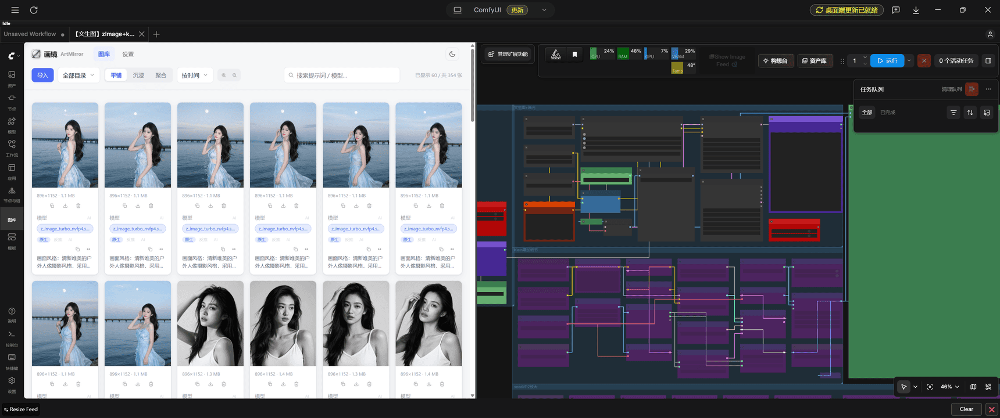
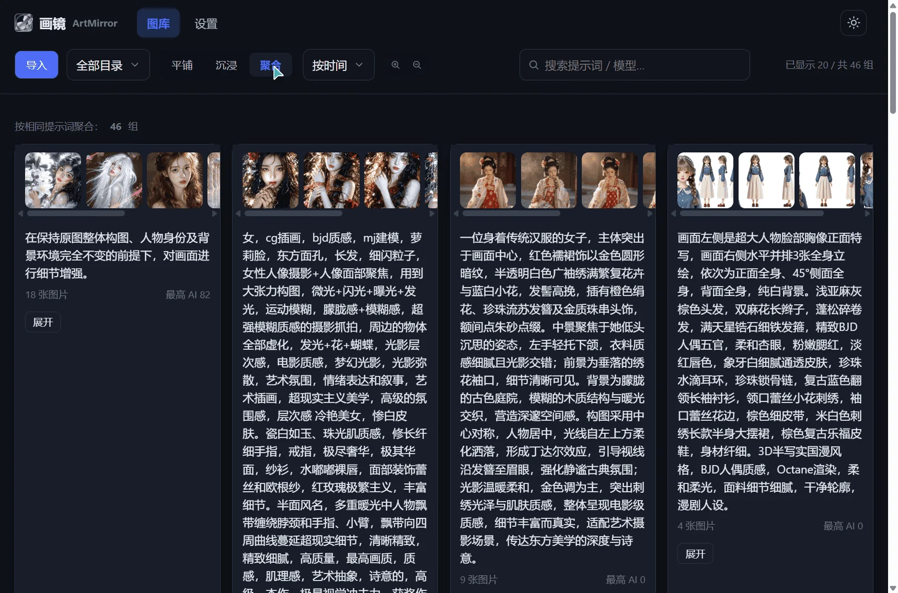
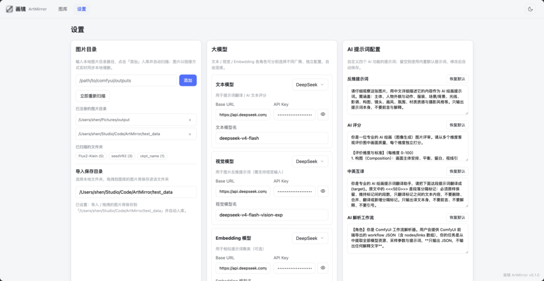

# ArtMirror 画镜（ComfyUI 图库插件）

在 ComfyUI 侧边栏内嵌一个「图库」tab，用于**浏览、管理、检索本地 ComfyUI 产出图片**。

自动解析 PNG 内嵌工作流 meta，并提供 AI 增强能力：反推提示词、中英互译、AI 评分、AI 工作流解析。



***

## 项目介绍

* **图片资产管理**：后台定时扫描 ComfyUI 输出目录（或任意本地图片目录），把图片引用与 meta 存入 SQLite，不存图片字节。

* **Workflow meta 解析**：解析 ComfyUI PNG 内嵌的 workflow / prompt 图，提取主模型、LoRA、VAE、采样参数与多段提示词。

* **AI 增强**：接入 OpenAI 兼容接口（可混搭不同厂商），支持提示词反推、中英互译、AI 多维度评分、AI 工作流解析。

* **多模式浏览**：平铺 / 沉浸 / 聚合三种预览视图，配合目录筛选、标签筛选、关键词搜索与多维排序。

* **个人单机工具**：无鉴权，后端仅在 `127.0.0.1` 进程内监听临时端口运行；插件数据落 `ComfyUI/user/artmirror/`。

***

## 安装指南

本插件是标准 ComfyUI 自定义节点包，安装流程与 ComfyUI 节点库（Custom Nodes）一致。以下三种方式任选其一。

### 方式一：手动安装（custom\_nodes）

1. 把插件放入 `custom_nodes/` 目录，两种做法任选：

    * **git clone**（推荐，便于后续 `git pull` 升级）：

      ```bash
      cd ComfyUI/custom_nodes
      git clone https://github.com/ShenZiLi/comfyui-gallery.git ComfyUI-ArtMirror
      ```

    * **直接拷贝**：本插件目录**自包含**（已内置核心 `artmirror/` 与前端 `static/`），
      整体拷为 `custom_nodes/ComfyUI-ArtMirror` 即可 —— **解压即用**

2. 依赖说明：

    * 插件自带 `requirements.txt`，**ComfyUI 启动时会自动安装**（标准机制，首次联网约 1-3 分钟），多数情况无需手动处理

    * 若自动安装失败，可在插件目录用 ComfyUI 的 Python 环境手动安装：
      ```bash
      pip install -r requirements.txt
      ```
      （依赖：`fastapi`、`uvicorn`、`sqlmodel`、`pillow`、`httpx` 等）

    * 需要**完全离线**的安装包（不依赖 ComfyUI 联网装依赖）时，可用主仓库的 `build_plugin.py` 生成带 `_deps/` 的发布包（注意 `_deps` 编译型包须与 ComfyUI 的 Python 版本匹配，用 `--python` 指定）：
      ```bash
      uv run python scripts/build_plugin.py --out build/ComfyUI-ArtMirror --bundle-deps --python 3.12
      ```

3. 完全重启 ComfyUI（Desktop 或网页版），使插件被加载

4. 左侧侧边栏点开「图库」tab，首次打开会自动在进程内启动后端并扫描 ComfyUI 输出目录

### 方式二：ComfyUI-Manager 节点库安装（Registry 需已发布）

需先安装 [ComfyUI-Manager](https://github.com/ltdrdata/ComfyUI-Manager)（ComfyUI Desktop 通常已自带）。

1. 打开 ComfyUI，点击顶部 **Manager** 按钮，进入 **Custom Nodes Manager / 节点安装**
2. 在顶部搜索框输入 `ArtMirror`（或 `ComfyUI-ArtMirror`），回车搜索
3. 在结果中找到 **ArtMirror 图库 / ComfyUI-ArtMirror**，点击右侧 **Install / 安装**
4. 等待下载与依赖安装完成，出现 **Install 成功提示**
5. 点击 **Restart / 重启 ComfyUI**
6. 重启后左侧侧边栏出现「图库」tab，即安装成功

> 说明：通过节点库安装需要插件已发布到 Comfy Registry。若仓库尚未发布，节点库内搜不到，请改用上方「方式一」手动安装。

### 方式三：交给 AI Agent 安装（如 WorkBuddy）

把下面这段提示词发给 AI 助手（WorkBuddy / Claude / Code 等 Agent），它会自动完成下载、安装与校验；把 `<你的 custom_nodes 路径>` 替换成你的 ComfyUI 实际路径即可。

> 安装 ComfyUI 插件「ArtMirror 图库」（ComfyUI-ArtMirror）：
>
> 1. 把仓库 `https://github.com/ShenZiLi/comfyui-gallery.git` 克隆到 `ComfyUI/custom_nodes/ComfyUI-ArtMirror`（custom\_nodes 路径：`<你的 custom_nodes 路径>`；若不存在则新建）
> 2. 项目自带 `_deps/` 本地依赖，一般无需安装；若 ComfyUI 运行环境报缺少依赖，按 `pyproject.toml` 的 `[project].dependencies` 用 ComfyUI 的 Python 环境安装
> 3. 引导我**完全重启** ComfyUI
> 4. 重启后确认左侧侧边栏出现「图库」tab；若白屏 / 503，检查 `ComfyUI/user/artmirror/` 目录与 ComfyUI 控制台日志并修复

### 使用说明

* 侧边栏出现「图库」tab；若同时安装了独立版画镜，两者功能一致、数据各自独立

* 数据位置：`ComfyUI/user/artmirror/`（数据库 + 缩略图 + 日志）

* 默认扫描根：ComfyUI 输出目录；可在 tab 内设置页修改 / 增加扫描目录

* 配置大模型后请点击「测试连接」验证，即可启用反推 / 翻译 / 评分等 AI 功能

***

## 数据与存储

* SQLite：只存图片引用（绝对路径 + SHA-256）与 meta，不存图片字节；缩略图以 `<sha>.webp` 缓存

* SHA-256 去重，删除走系统废纸篓（软删 + 物理回收）

* 清空数据 = 删除 `user/artmirror/` 目录

## 技术栈

| 层  | 技术                                                                                       |
| -- | ---------------------------------------------------------------------------------------- |
| 后端 | Python 3.11+ · FastAPI · SQLModel(SQLite) · Pillow · httpx，随 ComfyUI 进程内启动（uvicorn 临时端口） |
| 前端 | 无构建静态页 · Alpine.js（本地 vendor）· 手写 HTML/CSS/JS                                            |
| 集成 | `/artmirror/*` 反向代理到进程内 FastAPI；`WEB_DIRECTORY` 注册侧边栏扩展                                  |

***

## Web 端（可选，辅助使用）

不装 ComfyUI 时，仓库也可作为独立 Web 工具运行（浏览 / 管理任意本地图片目录，功能一致，数据独立于插件）。

| 平台 | 启动方式 |
| --- | --- |
| macOS | 双击 `start.command`（首次自动装依赖，完成后打开浏览器） |
| Windows | 双击 `启动.bat`（自动装依赖，完成后打开浏览器） |

手动启动（需已装 [uv](https://docs.astral.sh/uv/)）：

```bash
uv sync
uv run uvicorn launchers.web.main:app --host 0.0.0.0 --port 8000
# 访问 http://127.0.0.1:8000/gallery.html
```

Web 端数据落仓库根 `data/`（SQLite + 缩略图），清空数据 = 删 `data/artmirror.db` 与 `data/thumbs/`。

## 功能介绍

以下截图均来自运行中的实例。

### 🖼️ 图库浏览

图库主页：顶部工具栏（导入 / 目录筛选 / 视图切换 / 排序 / 搜索 / 缩放），左栏目录树，主区域为卡片网格，卡片含缩略图、尺寸、文件大小、模型标签、AI 评分、提示词与操作入口。


* **三种预览模式**

    * **平铺**：卡片 + 提示词（信息最丰富）

    * **沉浸**：纯图片墙（聚焦看图）

    * **聚合**：按相同 / 相似提示词分组（相似聚类阈值 0.92），一键复用一组图片的提示词

* **高清预览**：放大到列数 ≤ 4 时卡片自动切换为原图显示（HD 徽标提示）

* **导入**：支持「导入图片 / 导入目录」；本地目录保持相对结构、并自动注册为扫描根

* **页面动效**：模式切换 / 目录切换垂直翻页 / 搜索淡入淡出 / 跳转淡入淡出




### 🔍 检索与管理

* 目录筛选三模式同步、标签筛选（模型 / LoRA / VAE / 风格）、关键词搜索（匹配提示词 / 负向提示词 / 文件名，结果高亮）

* 多维排序：时间 / AI 评分 / 人工评分

* 大库性能：列表分页 + 无限滚动，万张图片流畅浏览

* 删除走系统废纸篓（可恢复）、复制图片、下载原图

### 🖼️ 图片详情

点击卡片进入详情：左侧原图大图，右侧信息栏含提示词、模型与采样参数、评分。

* **提示词**：原生 / 反推 / AI 三源切换、多段展示、点击段落直接复制、中英互译

* **模型与参数**：主模型 / LoRA / VAE 标签、steps / cfg / sampler / scheduler / seed、预览 / 导出工作流（可拖回 ComfyUI 复现）

* **评分**：人工星级（1–5）+ AI 多维度评分（0–100 并附依据）

  

### ✨ AI 增强


* **中英互译**：AI 互译并持久化，已有译文直接切换、不重复请求

* **AI 反推提示词**：视觉模型读取图片反推，与原 / AI 解析提示词对照

* **AI 评分**：视觉模型打分并给出依据，可在设置页自定义评分提示词


### ⚙️ 设置

配置中心：扫描目录、已扫描文件夹管理、导入保存目录、大模型三角色配置与连通性测试、AI 提示词自定义。


* **目录管理**：注册 / 移除扫描根；扫描后文件夹 chips 展示，可隐藏 / 恢复

* **导入保存目录**：配置导入 / 拖拽图片的目标目录（未配置回退应用数据自管区）

* **大模型**：文本 / 视觉 / Embedding 三角色独立配置（支持 DeepSeek / Qwen / GLM / OpenAI / 自定义），一键并发测试连通性

* **AI 提示词**：反推 / 评分 / 互译 / 工作流解析四组提示词可自定义



***

## 许可

MIT
