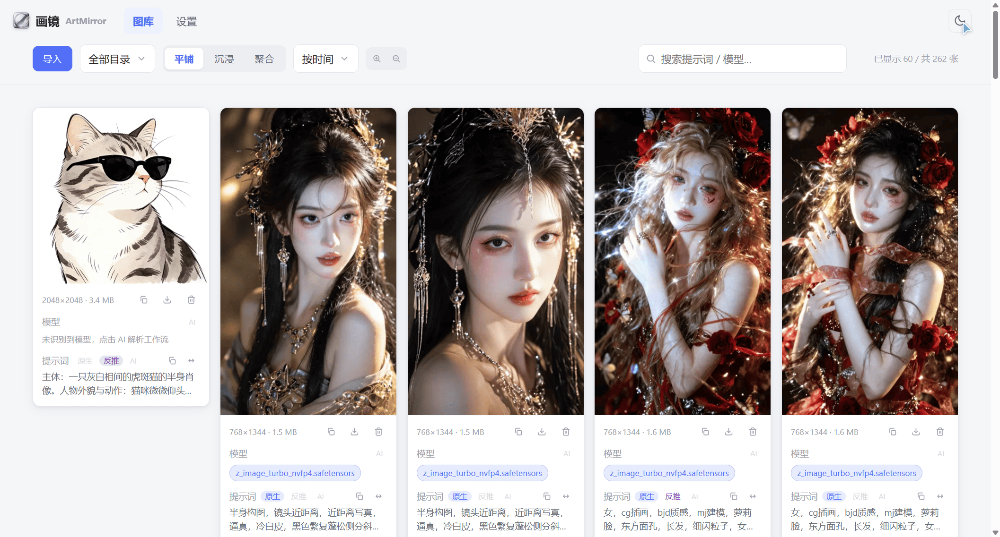
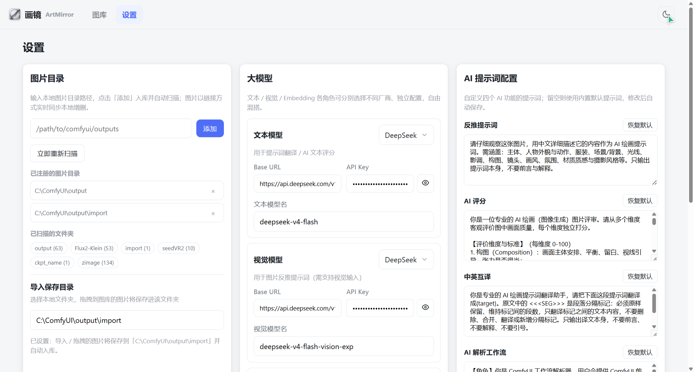

# 画镜 ArtMirror

一个基于 **Python + FastAPI** 的 ComfyUI 图片/提示词资产管理工具：浏览、管理、检索本地 ComfyUI 产出图片，解析图片内嵌工作流 meta，并提供 AI 增强能力（反推提示词、中英互译、AI 评分、工作流解析）。

> 个人单机工具：单进程同时提供 REST API 与前端静态托管，无鉴权，建议仅在可信局域网/本机使用。

## 功能特性

- **图片采集**：后台定时扫描注册目录、浏览器/拖拽导入图片、目录批量导入（保留目录结构）
- **图库浏览**：平铺（卡片 + 提示词）/ 沉浸（纯图墙）/ 聚合（按提示词分组）三种预览模式
- **检索管理**：目录筛选（三模式同步）、标签筛选、关键词搜索、多维排序（时间 / AI 评分 / 人工评分）
- **元数据解析**：ComfyUI PNG 内嵌 workflow/prompt 解析，提取模型 / LoRA / VAE 标签与采样参数
- **AI 增强**：反推提示词、提示词中英互译、AI 多维度评分、AI 工作流解析（模型 + 提示词）
- **实时同步**：后台 watcher 扫描本地图片目录，前端轮询自动刷新
- **高清预览**：放大到列数 ≤4 时卡片自动切换原图显示

## 技术栈

| 层 | 技术 |
| --- | --- |
| 后端 | Python 3.12 · FastAPI · SQLModel(SQLite) · Pillow · httpx |
| 前端 | 无构建静态页 · Alpine.js（本地 vendor）· 手写 HTML/CSS/JS |
| 依赖管理 | uv（pyproject.toml / uv.lock） |

## 目录结构

```
ArtMirror/
├── backend/                 # Python + FastAPI 后端（API + 前端静态托管）
│   ├── app/
│   │   ├── main.py          # 应用入口：启动 watcher、托管静态、NoCache 静态
│   │   ├── models.py        # SQLModel 全部表模型
│   │   ├── database.py      # SQLite engine + 迁移 + 索引
│   │   ├── config.py        # 环境配置（data_dir / llm_* / frontend_dir）
│   │   ├── parsers/         # ComfyUI PNG meta 解析
│   │   ├── services/        # scanner / watcher / llm / meta_service
│   │   └── routers/         # images / folders / tags / aggregate / settings / fs / sync
│   ├── tests/               # pytest
│   ├── pyproject.toml       # uv 管理依赖
│   └── uv.lock
├── frontend/                # 无构建静态前端
│   ├── gallery.html / settings.html / image.html / index.html
│   ├── api.js / app.js / style.css / mock-data.js
│   └── vendor/alpine.min.js
├── docs/                    # 功能清单 / 设计文档 / 截图
└── README.md
```

## 小白快速启动（Windows）

1. 安装 **Python 3.11 或更高**（[python.org 下载](https://www.python.org/downloads/)，安装时勾选 **Add Python to PATH**）
2. 双击项目根目录的 **`启动.bat`**
3. 首次会自动创建虚拟环境并安装依赖（约 1-3 分钟），之后秒启
4. 启动完成后自动打开浏览器进入图库；窗口保持运行，**按回车键停止服务并退出**

> 服务地址：http://127.0.0.1:8000/gallery.html（手动访问也可）

## 部署流程

### 环境要求

- Python 3.12+
- [uv](https://docs.astral.sh/uv/)（Python 包管理）
- ComfyUI 输出目录（可配置任意本地图片目录）

### 安装与启动

```bash
# 1. 进入后端目录
cd backend

# 2. 安装/同步依赖（首次）
uv sync

# 3. 启动服务（API + 前端托管）
uv run uvicorn app.main:app --host 0.0.0.0 --port 8000
```

### 访问

| 地址 | 说明 |
| --- | --- |
| http://127.0.0.1:8000/gallery.html | 图库 |
| http://127.0.0.1:8000/settings.html | 设置 |
| http://127.0.0.1:8000/docs | 后端 OpenAPI 文档 |

### 首次配置

1. 打开 **设置** 页
2. 在「图片目录」添加你的 ComfyUI 输出目录（校验目录存在、防路径穿越）
3. 可选：配置「大模型」三角色（文本 / 视觉 / Embedding，OpenAI 兼容接口）以启用反推 / 翻译 / 评分 / 解析
4. 返回 **图库** 即可浏览已扫描图片

### 数据与运行目录

- 运行数据位于 `data/`（SQLite 库 `data/artmirror.db` + 缩略图 `data/thumbs/`），已被 `.gitignore` 忽略
- 每图只存引用（绝对路径 + sha256）与 meta，不存图片字节
- 清空数据 = 删除 `data/artmirror.db` 与 `data/thumbs/`

### 局域网访问

服务监听 `0.0.0.0`，同局域网设备通过本机 IP + 端口访问前端地址即可（单用户无鉴权，仅限可信网络）。

## 前端页面

以下截图均来自运行中的实例（亮色主题）。

### 图库页（gallery.html）

图库主页：顶部导航与工具栏（导入、目录筛选、视图切换、排序、搜索、缩放），左栏目录树，主区域三种预览模式（默认平铺，卡片含缩略图、尺寸、模型标签、提示词与操作入口）。



- **三种预览模式**：平铺（卡片 + 提示词）/ 沉浸（纯图片墙）/ 聚合（按相同提示词分组）
- **导入**：支持「导入图片 / 导入目录」，目录导入后同步显示于「全部目录」与设置页
- **高清预览**：放大到列数 ≤4 时自动切换原图显示（HD 徽标提示）
- **动效**：模式切换翻页、目录切换垂直翻页、搜索淡入淡出、页面跳转淡入淡出

### 图片详情页（image.html）

点击图库卡片进入详情：左侧原图大图，右侧信息栏包含提示词（原生 / 反推 / AI 三源 + 中英互译）、模型与采样参数、评分（人工星级 + AI 评分）。


- **提示词**：三源切换、多段展示、段落点击复制、中英互译（AI，已有译文直接切换）
- **模型**：主模型 / LoRA / VAE 标签、steps/cfg/sampler/scheduler/seed 参数、预览工作流、AI 解析
- **评分**：人工评分（1-5 星）、AI 多维度评分（0-100 + 依据）、刷新按钮
- 图片名称悬停显示完整路径气泡，点击可复制路径

### 设置页（settings.html）

配置中心：已注册的图片目录、已扫描的文件夹（隐藏/恢复）、导入保存目录、大模型三角色配置与连通性测试、AI 提示词自定义。



- **目录管理**：注册/移除扫描根，扫描后文件夹同步显示
- **已扫描的文件夹**：chips 展示含图片的文件夹，点击隐藏/恢复
- **导入保存目录**：配置导入/拖拽图片的目标目录（未配置回退 `data/import`）
- **大模型**：文本 / 视觉 / Embedding 三角色配置 + 一键连通性测试
- **AI 提示词配置**：反推 / 评分 / 互译 / 工作流解析四组提示词可自定义

## 文档

- [docs/功能清单.md](docs/功能清单.md) — 全部功能点与更新记录
- [docs/设计文档.md](docs/设计文档.md) — 详细设计（架构 / 数据模型 / API / 前端能力）

## License

MIT
