# 画镜 ArtMirror — 详细设计文档

> 版本：2026-08-29 · 基于当前 `dev` 分支代码
> 配套文档：[功能清单.md](./功能清单.md)（功能点与更新记录）、[AGENTS.md](../AGENTS.md)（工程约定）

## 1. 项目概述

画镜 ArtMirror 是一个 **ComfyUI 图片/提示词资产管理工具**：浏览、管理、检索本地 ComfyUI 产出的图片，解析图片内嵌的工作流 meta，并提供 AI 增强能力（反推提示词、中英互译、AI 评分、工作流解析）。

定位：个人单机工具，单进程同时提供 REST API 与前端静态托管，无鉴权，仅运行在可信局域网/本机。

### 1.1 核心能力

* **图片采集**：后台定时扫描注册目录、浏览器/拖拽导入图片、目录批量导入

* **图库浏览**：平铺（卡片+提示词）/ 沉浸（纯图）/ 聚合（按提示词分组）三种预览模式

* **检索**：目录筛选、标签筛选、关键词搜索、多维排序（时间/AI 评分/人工评分）

* **元数据**：ComfyUI PNG 内嵌 workflow/prompt 解析，提取模型/LoRA/VAE 标签、采样参数

* **AI 增强**：反推提示词、提示词中英互译、AI 多维度评分、AI 工作流解析

### 1.2 技术栈

| 层    | 技术                                                        |
| ---- | --------------------------------------------------------- |
| 后端   | Python 3.12 · FastAPI · SQLModel(SQLite) · Pillow · httpx |
| 前端   | 无构建静态页 · Alpine.js（本地 vendor）· 手写 HTML/CSS/JS             |
| 依赖管理 | uv（pyproject.toml / uv.lock）                              |
| 数据库  | SQLite `data/artmirror.db`（每图只存引用与 meta，不存图片字节）           |

## 2. 系统架构

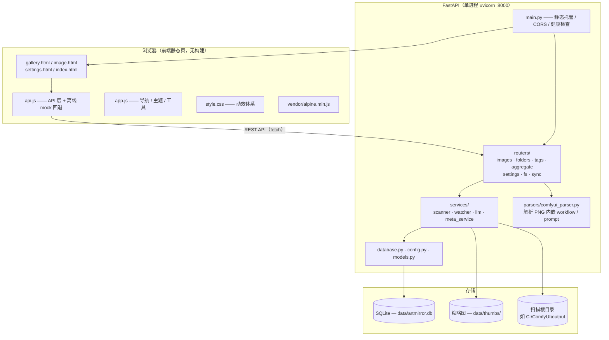

## 3. 后端设计

### 3.1 配置（config.py）

pydantic-settings 加载，环境变量前缀 `AM_`，支持 `.env`：

| 配置                                                                 | 说明                                   |
| ------------------------------------------------------------------ | ------------------------------------ |
| `data_dir`                                                         | 本地数据目录（DB/缩略图），默认 `backend/../data`  |
| `scan_root`                                                        | 扫描根目录（历史单根字段；当前以设置表 `scan_roots` 为准） |
| `llm_base_url / api_key / vision_model / text_model / embed_model` | 大模型（OpenAI 兼容）配置                     |
| `frontend_dir`                                                     | 前端静态目录                               |
| `db_path / thumbs_dir`                                             | 派生属性：SQLite 路径、缩略图目录                 |

### 3.2 数据模型（models.py）

所有表继承 `BaseModel`（id / create\_time / update\_time / is\_deleted 软删字段）。

| 表                   | 说明                      | 关键字段                                                                                                                                                                                                                                         |
| ------------------- | ----------------------- | -------------------------------------------------------------------------------------------------------------------------------------------------------------------------------------------------------------------------------------------- |
| `Folder`            | 目录节点（树形）                | parent\_id、name、path（绝对路径）、sort\_order                                                                                                                                                                                                       |
| `ImageAsset`        | 图片资产（只存引用）              | folder\_id、file\_name、file\_path（相对根，唯一）、abs\_path（物理绝对路径）、sha256（去重）、width/height/file\_size/file\_mtime、thumb\_ok、prompt\_type、rating（人工 1-5）、ai\_rating（AI 0-100）                                                                         |
| `WorkflowMeta`      | 解析出的工作流信息               | image\_id（唯一）、prompt/negative\_prompt、prompt\_graph\_json/workflow\_json、steps/cfg/sampler/scheduler/seed/denoise、model\_name、ai\_prompt/ai\_negative\_prompt、origin\_prompts\_json/negative\_prompts\_json/ai\_prompts\_json（多段提示词 JSON 列表） |
| `Tag`               | 标签（模型/LoRA/VAE/其他）      | name、category（model/lora/vae/embedding/style/special）、count（使用计数）                                                                                                                                                                            |
| `ImageTag`          | 图片-标签多对多                | image\_id、tag\_id                                                                                                                                                                                                                            |
| `ReversePrompt`     | AI 反推提示词（与原生分离）         | image\_id、engine、model\_name、text                                                                                                                                                                                                            |
| `PromptTranslation` | 提示词中英翻译                 | image\_id、prompt\_kind（origin/reverse/ai）、lang（zh/en）、text                                                                                                                                                                                   |
| `RatingRecord`      | 评分历史（最新值汇总到 ImageAsset） | image\_id、rating\_type（ai/manual）、score、reason                                                                                                                                                                                               |
| `ClusterGroup`      | 聚合/聚类分组结果               | group\_key、cluster\_type、name、sort\_rank                                                                                                                                                                                                     |
| `Setting`           | 键值配置                    | key（唯一）、value                                                                                                                                                                                                                                |

### 3.3 数据库与迁移（database.py）

* SQLite 引擎：`check_same_thread=False`（后台线程可访问）+ `timeout=30`（并发写等待）

* `init_db()`：建表 + 幂等迁移（`_migrate_sqlite` 手工补 `WorkflowMeta` 新列）+ 性能索引（`ix_image_folder` / `ix_image_ai_rating` / `ix_image_rating`）

* `get_session()`：FastAPI 依赖提供会话

### 3.4 路由 / API（24 个端点）

**images**（`/api/images`）

* `GET ""` 列表：分页 + 目录/标签/关键词过滤 + 排序 + 批量组装（去 N+1）+ slim 瘦身

* `GET /{image_id}` 详情（含多段提示词、译文 `translations`、`absPath`）

* `GET /{image_id}/thumb` 缩略图（缓存头）

* `GET /{image_id}/file` 原图

* `DELETE /{image_id}` 删除（原文件进系统废纸篓 + 软删记录）

* `POST /{image_id}/reparse-models` AI 重解析模型/提示词

* `POST /{image_id}/rating` 人工评分

* `POST /{image_id}/score` AI 评分

* `POST /{image_id}/reverse` AI 反推提示词

* `POST /{image_id}/translate` 中英互译（多段：`<<<SEG>>>` 分隔拼接→翻译→切回 `texts` 数组）

**folders**（`/api/folders`）

* `GET ""` 目录列表（含图片计数/隐藏状态；仅返回注册根前缀下节点）

* `POST /{folder_id}/toggle-hidden` 隐藏/恢复文件夹

**tags**（`/api/tags`）

* `GET ""` 标签列表

**aggregate**（`/api/aggregate`）

* `GET /by-prompt` 按提示词分组（分页，支持 `folder_id` 过滤）

* `GET /by-prompt/members` 组内成员（懒加载分页）

* `GET /dimensions` 维度聚类

**settings**（`/api/settings`）

* `GET ""` 全部设置（scanRoots/LLM 三角色/导入目录/自定义提示词）

* `POST ""` 更新设置

* `POST /roots` 注册扫描目录（校验 is\_dir + 后台扫描 + bump）

* `DELETE /roots` 移除扫描目录（软删其下图片 + 清理目录节点）

* `POST /upload` 导入图片（支持 `path` 相对子路径，目录导入保留结构 + 注册顶层子目录为扫描根 + 立即后台扫描）

**fs**（`/api/fs`）

* `GET /roots` 可选起始目录（home/卷/根）

* `GET /list` 列出子目录（服务端驱动文件夹选择）

**sync**（`/api/sync`）

* `GET /version` 同步版本号（前端轮询检测后台变化）

### 3.5 服务层（services/）

#### scanner.py — 扫描入库

* `scan_all / scan`：递归扫描根目录，`sha256` 去重，`mtime+size` 增量更新，生成 WebP 缩略图

* 嵌套根处理：注册在父根之下的嵌套根，其子树由嵌套根自己扫描（父根跳过，避免重复）

* `_ensure_folders`：os.walk 建立 Folder 树

* 软删：库中在根内但本次未扫描到的文件标记 `is_deleted=1`

* 并发冲突（`IntegrityError`）回滚后按更新重查

* `unlink_root`：移除根时软删其下图片并清理目录节点

#### watcher.py — 后台实时同步

* 常驻线程 `_loop`：每 20s 对注册根 `scan_all`，有增删改则递增版本号 `bump()`

* `_scanning` 锁：跳过重叠扫描

* 前端 3s 轮询 `/api/sync/version`，版本变化即刷新图库

#### llm.py — 大模型服务（OpenAI 兼容）

* 三角色：text（翻译/评分解析）/ vision（反推/评分看图）/ embed

* `chat_text` / `chat_vision`：httpx 直连（`trust_env=False` 避免代理出口 IP 被限流）

* <br />

  > 5MB 图片先压缩（降尺寸 + JPEG）再发视觉模型

* 业务封装：`reverse_prompt_image`（反推）、`score_image`（多维度评分 JSON）、`translate_prompt`（中英互译，保留 `<<<SEG>>>` 段落）、`analyze_workflow`（AI 解析工作流）

* 提示词模板可经设置自定义（`prompt_*`），留空用代码默认常量

#### meta\_service.py — 解析结果落库

* `ingest`：写入 WorkflowMeta + 维护模型/LoRA/VAE 标签（多对多，计数）

* `migrate_tag_paths`：历史标签归一为 basename 并合并重复

* `replace_asset_tags`：AI 重解析后按类别重建标签

### 3.6 解析器（parsers/comfyui\_parser.py）

ComfyUI 在 PNG 写入 `workflow`（UI 图）与 `prompt`（API 图）两个文本 chunk（base64→latin-1 转码）。

* 按 KSampler 的 conditioning 连接关系区分正/负提示词

* 按节点 class\_type 提取主模型（CheckpointLoader\*/UnetLoader\* 等变种）、LoRA、VAE

* 提取采样参数（steps/cfg/sampler/scheduler/seed/denoise）

* 输出 `ParseResult`（含多段 positive/negative 提示词列表）

## 4. 前端设计

### 4.1 页面结构

| 页面              | 功能                                                     |
| --------------- | ------------------------------------------------------ |
| `index.html`    | 重定向到图库                                                 |
| `gallery.html`  | 图库主页：工具栏（导入/目录/排序/搜索/缩放）、三种预览模式、无限滚动、聚合分组、快照恢复         |
| `image.html`    | 图片详情：大图、提示词三源（原生/反推/AI）+ 中英译、模型参数、评分、工作流预览             |
| `settings.html` | 设置：扫描目录管理、已扫描文件夹（隐藏/恢复）、大模型三角色配置与连通性测试、导入保存目录、AI 提示词配置 |

### 4.2 API 层（api.js）

* `Api` 全局对象封装全部 REST 调用；`req()` 统一 fetch + 错误提取

* **离线回退**：后端不可用时 `Api._fallback=true`，各接口回退到 `Mock`（mock-data.js）数据

* `uploadImages`：分批并发上传（每批 8），目录导入自动携带 `webkitRelativePath`

### 4.3 公共脚本（app.js）

* `navHTML / initNav`：注入顶部导航（图库/设置 + 品牌图标 + 主题切换）

* `applyTheme / toggleTheme`：亮暗主题（localStorage `am-theme`，View Transitions 圆形扩散）

* `go(url)`：页面间跳转淡出（`am-page-out`）后导航，导航链接统一拦截

* `copyText / toast / highlight / starHTML / fmtSize`：通用工具

* `data-tip` 顶层气泡机制（`am-tip-bubble`，600ms 延迟，支持 `data-tip-delay`）

### 4.4 动效体系（style.css + 各页 JS）

| 动效       | 类/机制                                                      | 触发                  |
| -------- | --------------------------------------------------------- | ------------------- |
| 模式切换翻页   | `am-turn-right/left` + `am-turn-in`（animation）            | 平铺/沉浸/聚合切换，右翻/左翻    |
| 目录切换垂直翻页 | `am-flip-down/up` + `am-flip-in`（animation，forwards 保持终点） | 目录下拉选下方/上方目录        |
| 缩放转场     | `am-zooming`（微缩淡出）                                        | 放大/缩小列数             |
| 搜索淡入淡出   | `am-fade-out` + `am-fade-in`（animation）                   | 搜索框结果切换             |
| 页面跳转     | body `am-page-in/out`                                     | 页面加载/离开             |
| 顶层气泡     | `am-tip-bubble`                                           | 全站 `data-tip` 悬停    |
| 高清预览     | `hiRes` + IntersectionObserver 渐进替换                       | 平铺/沉浸列数 ≤4 时原图替换缩略图 |

### 4.5 图库页关键机制

* **三模式**：flat（卡片+提示词）/ immersive（纯图）/ aggregate（分组）；行优先 grid（先横后纵，排序顺序左上→右下）

* **数据**：`images`（平铺/沉浸共享）、`groups`（聚合，含所属目录 `_groupsFolder`）、`folders`（目录下拉）、快照 sessionStorage（详情页返回秒开 + 滚动恢复 + bfcache pageshow）

* **目录筛选三模式同步**：`selectFolder` + `_reloadForMode`（聚合→reloadGroups、其他→loadImages），`_groupsFolder`/`_imagesFolder` 判断目录变化需重载

* **无限滚动**：IntersectionObserver 哨兵（`_rearm`）+ 加载更多

* **高清原图**：列数 ≤4 时 `_updateHiRes`，IO 对视口卡片预加载原图替换 src，多列回退缩略图

* **导入**：菜单「导入图片 / 导入目录」（webkitdirectory），导入后 `_refreshFolders` 刷新目录下拉

### 4.6 详情页关键机制

* 提示词三源切换（原生/反推/AI），多段展示

* 中英译：`_splitSegs` 按 `<<<SEG>>>`/换行拆分，`_alignSegs` 按原文长度降序索引对齐译文

* 提示词段落点击复制（`prompt-clickable`，user-select:none）、负向可复制

* 图片名称悬停显示完整路径气泡 + 点击复制路径

* AI 按钮悬停 1.5s 气泡（`data-tip-delay`）

### 4.7 前端能力展示（截图）

以下截图均来自运行中的实例（`http://127.0.0.1:8000`），按页面分组介绍前端实际提供的能力。图片存放在 `docs/screenshots/`。

#### 4.7.1 图库页（gallery.html）

**平铺模式** —— 默认视图，行优先网格（先横后纵），卡片含缩略图、尺寸/大小、模型标签、提示词三源与复制/工作流操作：

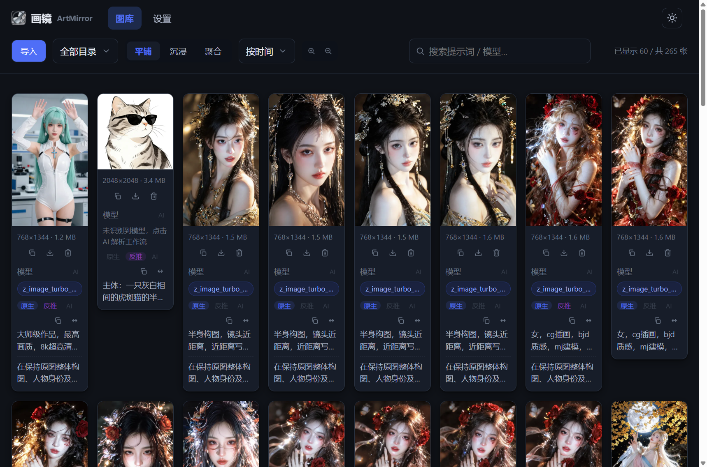

* 顶部：品牌「画镜 ArtMirror」+ 导航（图库/设置）+ 明暗切换

* 工具栏：导入、全部目录下拉、视图切换（平铺/沉浸/聚合）、排序、搜索框、缩放（放大/缩小列数）

* 卡片：缩略图（aspect-ratio 占位防跳动）、尺寸与大小、模型/LoRA/VAE 标签、原生/反推/AI 提示词源按钮、复制提示词与预览工作流图标

**导入菜单** —— 支持「导入图片 / 导入目录」两种方式：

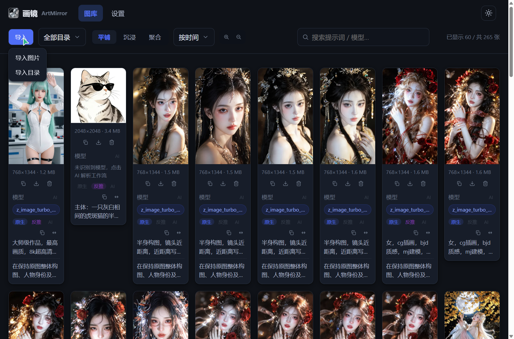

* 导入图片：多选图片文件上传到「导入保存目录」

* 导入目录：`webkitdirectory` 选择整个目录，批量上传并保留目录结构，同步显示于「全部目录」与设置页两处

**目录下拉** —— 显示全部目录及各目录图片数量，选择后三种模式同步筛选：

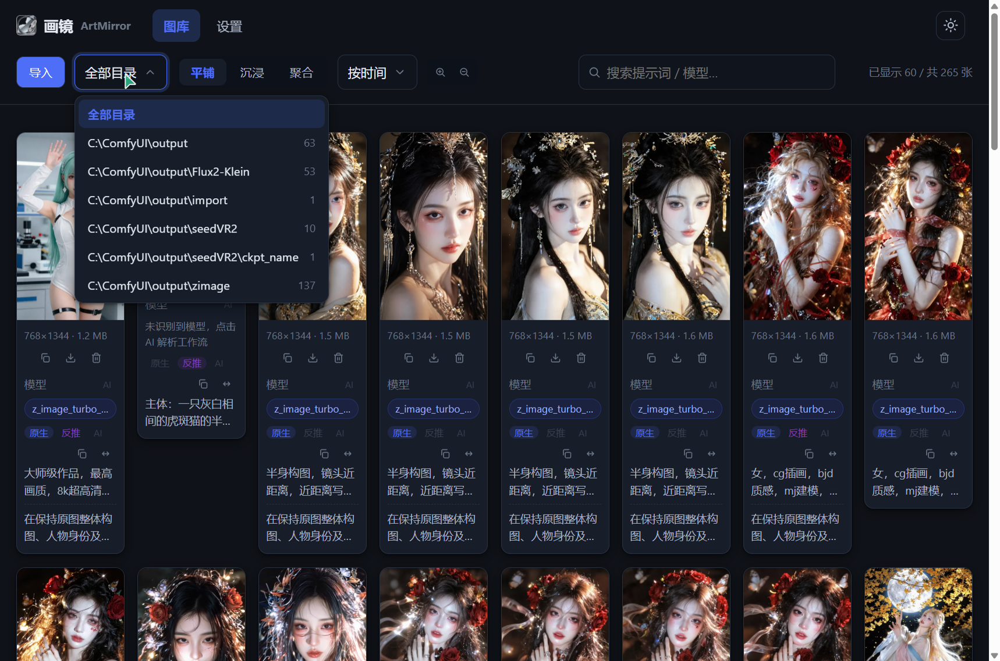

**沉浸模式** —— 纯图片墙（图片上方不叠加任何图标/文字），保留原始宽高比：

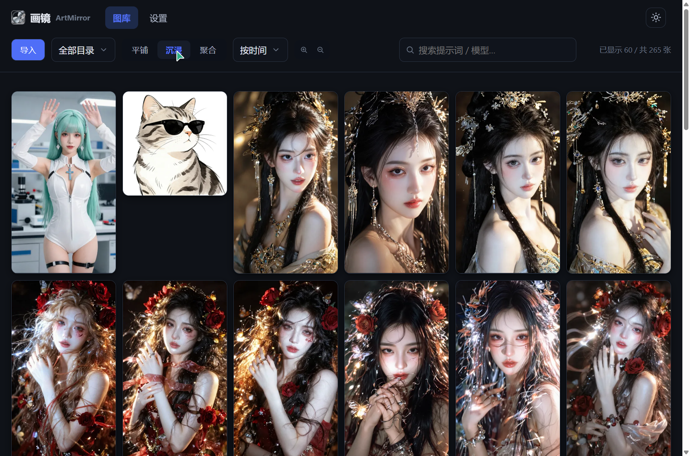

**聚合模式** —— 按相同提示词聚合分组，显示组标题（可单击复制）、成员数、最高 AI 评分与展开/收起：

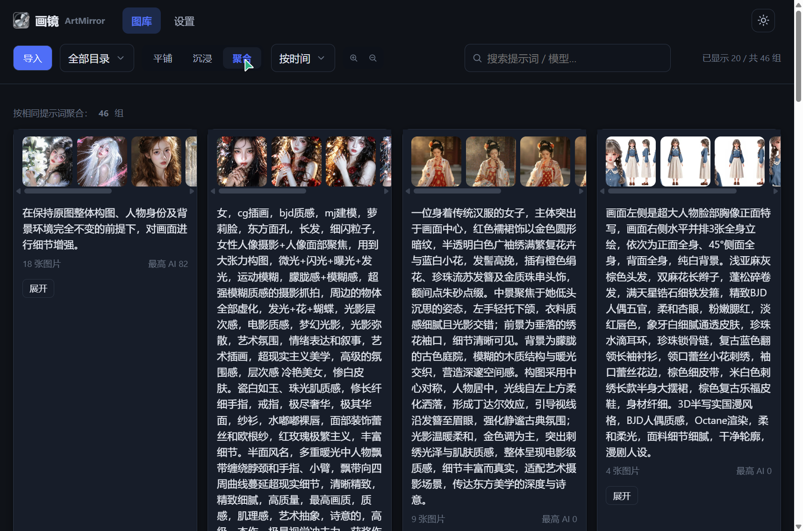

#### 4.7.2 详情页（image.html）

**详情页整体** —— 左侧原图大图，右侧信息栏（提示词 / 模型 / 评分 三卡片）：


* 提示词卡片：原生/反推/AI 三源切换、「中英译」按钮、多段提示词逐段展示（点击段落可复制该段）

* 模型卡片：主模型/LoRA/VAE 标签（chips）、采样参数（steps/cfg/sampler/scheduler/seed）、「预览工作流」与「AI 解析」按钮

* 评分卡片：人工评分（星级）、AI 评分（刷新按钮 + AI 依据）

**中英互译** —— 点击「中英译」后切换显示译文（已有译文直接本地切换，不重复请求 AI）：

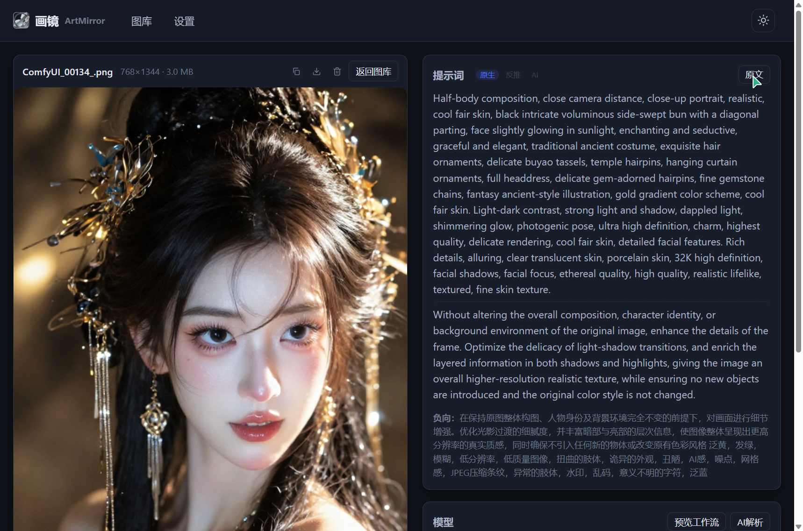

**AI 评分区域** —— 无评分时显示灰色「—」，有评分时蓝色；刷新按钮触发 AI 重新评分：


#### 4.7.3 设置页（settings.html）

**目录管理** —— 「已注册的图片目录」（可移除）与「已扫描的文件夹」（chip 点击隐藏/恢复，悬停气泡提示）：

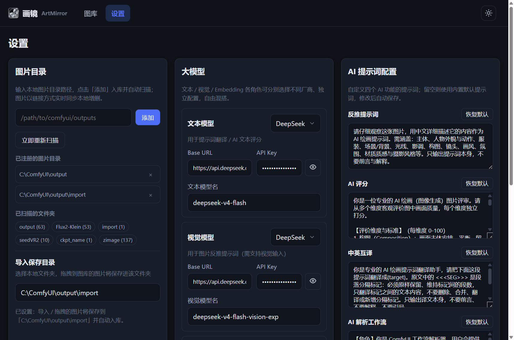

**大模型配置** —— 文本/视觉/Embedding 三角色（厂商/Base URL/API Key/模型）与「测试连接」：

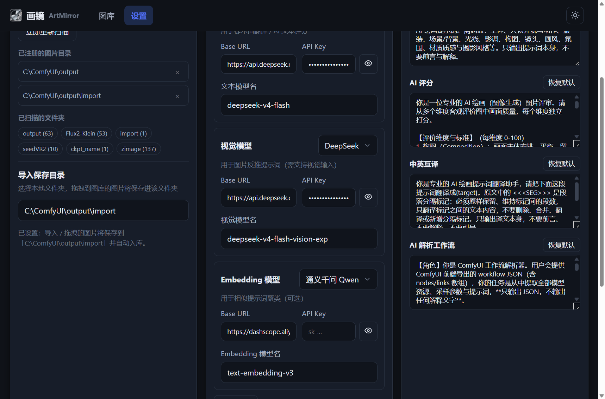

**导入保存目录** —— 配置导入/拖拽图片的目标目录（未配置回退 data/import）：

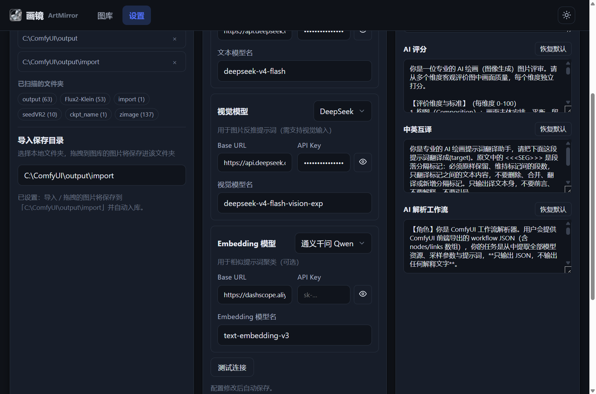

**AI 提示词配置** —— 反推/评分/互译/工作流解析四组自定义提示词（留空用内置默认，修改自动保存，可恢复默认）：

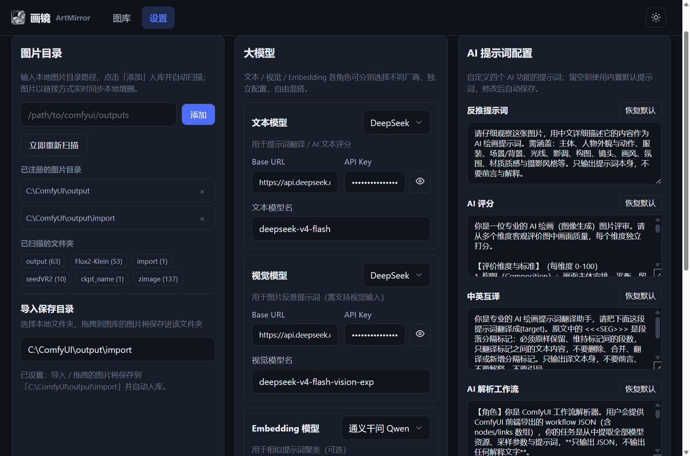

## 5. 关键流程 / 数据流

### 5.1 扫描入库流程

```
注册根目录（设置页 / 导入上传）
  → scanner.scan(根)：os.walk 递归
    → 跳过隐藏目录与嵌套根子树
    → 图片文件：sha256 去重 + mtime/size 增量
    → 读取字节 → comfyui_parser.parse_bytes（解析 workflow/prompt）
    → 生成 WebP 缩略图（data/thumbs/<sha>.webp）
    → 建 Folder 树 → 新建/更新 ImageAsset
    → meta_service.ingest：写 WorkflowMeta + 标签
  → 软删消失文件
  → watcher.bump()：版本号 +1
  → 前端 pollSync（3s）检测版本变化 → 刷新图库
```

### 5.2 实时同步机制

* 后端 `watcher._loop` 20s 扫描一次所有注册根

* 任何变化 `bump()` 递增内存版本号

* 前端每 3s 轮询 `/api/sync/version`，变化即 `loadImages`/`reloadGroups` + 刷新 folders/tags

### 5.3 AI 增强流程

| 能力       | 模型角色   | 触发                     |
| -------- | ------ | ---------------------- |
| 反推提示词    | vision | 详情/卡片「反推」              |
| AI 评分    | vision | 详情「AI 评分」              |
| 中英互译     | text   | 详情「中英译」（多段 SEG 分隔）     |
| AI 解析工作流 | text   | 详情/卡片「AI 解析」（模型 + 提示词） |

### 5.4 导入流程

* **图片导入**：`<input type=file multiple>` → `uploadImages` 逐文件 POST `/api/settings/upload` → 保存到导入保存目录（import\_dir，未配置回退 data/import）→ 自动注册 import\_dir 为扫描根 → 后台扫描入库

* **目录导入**：`<input type=file webkitdirectory>` → 图片带 `webkitRelativePath` 上传（后端保留目录结构落盘）→ 注册 `import_dir/<顶层目录名>` 为扫描根并**立即后台扫描** → 图片即时入库 → 图库「全部目录」、设置「已注册图片目录」「已扫描文件夹」三处同步

## 6. 关键设计决策与工程约定

1. **图片只存引用**：DB 存 `abs_path`/`sha256` 与 meta，不存图片字节；缩略图独立缓存
2. **软删**：`is_deleted=1`，删除原文件进系统废纸篓（Send2Trash）
3. **嵌套根**：父根扫描跳过嵌套注册根子树，由嵌套根自扫，避免重复
4. **实时同步**：watcher 20s + 前端 3s 轮询版本号，改动即刷新
5. **前端无构建**：Alpine.js 本地化（不依赖外网 CDN），静态 no-cache 刷新即生效
6. **图片不可被遮盖**：图片上方不叠加图标/文字，提示信息放图片之外
7. **多段提示词**：存储为 JSON 列表；翻译用 `<<<SEG>>>` 分隔标记保证段落保留与切回
8. **动效**：animation/transition 统一命名（am-\*），支持 `prefers-reduced-motion` 关闭
9. **验证约定**：前端改动不使用自动化浏览器验证（AGENTS.md）；后端改动重启 + curl/单测
10. **Window 路径**：代码统一使用规范化分隔符

## 7. 部署

个人单机工具，直接运行：

```bash
cd backend
uv sync
uv run uvicorn app.main:app --host 0.0.0.0 --port 8000
```

* 访问：`http://127.0.0.1:8000/gallery.html`

* 数据：`data/`（DB + 缩略图，gitignore），清空 = 删 `data/artmirror.db` 与 `data/thumbs/`

* 跨机访问：前端通过局域网地址调用（单用户无鉴权，仅限可信网络）

## 8. 测试

* `backend/tests/`：pytest（images/aggregate/scanner/fs/parser/migrations）

* 说明：部分用例在 Windows 下存在 SQLite 临时文件句柄未释放导致清理失败的环境问题（与代码逻辑无关）

